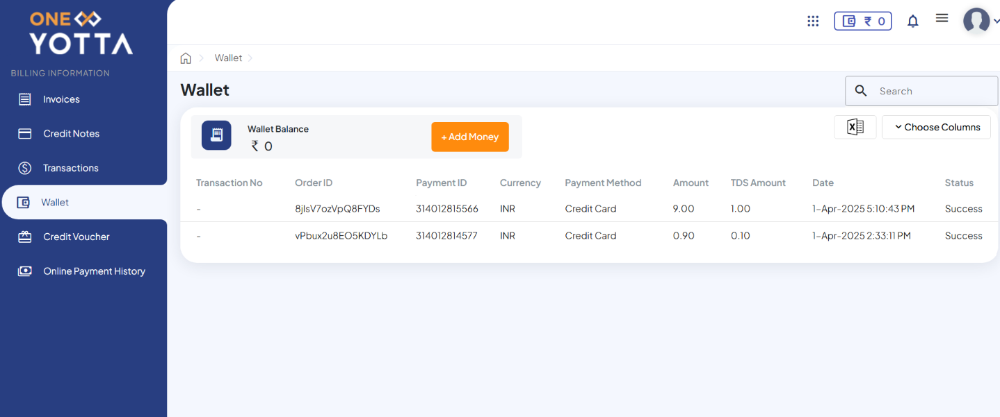
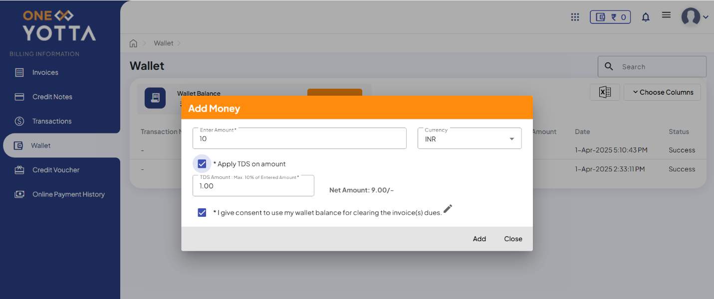

# Adding Wallet Balance

The following are the steps to Add Wallet Balance to your Shakti Cloud account:

1. Navigate to the **Wallet & Vouchers** tab on the dashboard screen.
2. To open the Add Wallet Balance screen, click on it.
	
3. The following screen appears:
	
4. Click **ADD BALANCE**. It redirects you to the One Yotta platform.
5. To add money in a wallet, click the **Add Money** button.
   
6. Enter the amount and click **Add**. It redirects you to the payment checkout page with various payment options.
   
7. After successful payment, the amount will be displayed in the wallet balance.