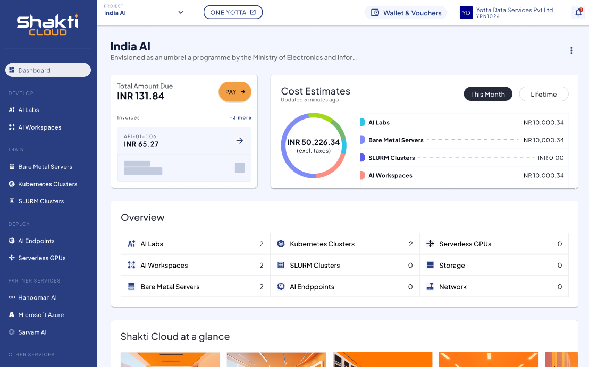

# Creating New Project

You can create a New Project based on your requirements and purchase various services. A project dropdown in the top right of the dashboard lets you create new project.

1. Under **Projects**, click the **New Project** button.
2. Enter the **Project Name** and **Project Description**.
3. Click **Create**.
   

Once your new project is successfully created, the following purchase details are visible on the dashboard screen:
- The **Total Amount Due** section displays the amount you need to pay. You can complete the payment by clicking the **PAY →** button.
- The **Cost Estimates** section displays the costs for services users purchased this month and over their lifetime.
- The **Overview** section displays how many instances users purchased for each service.
- The **Shakti Cloud at a Glance** section displays all available services.