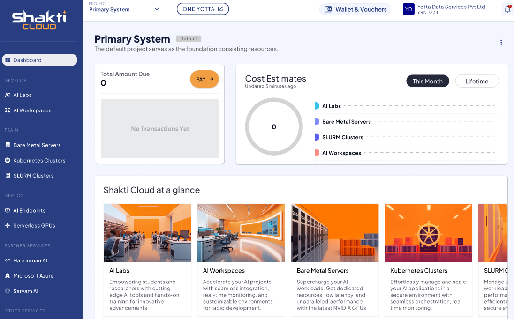

# Default Project

When you successfully login into Shakti Cloud, you can see the below default project screen. The **Default Project** provides a pre-configured workspace for new users to start working immediately. 

It displays the following information:
- **Total Amount Due** – Displays the balance that you need to pay for your default project.
- **Cost Estimates** – Shows the cost based on the services purchased for this month and Lifetime
- **Shakti Cloud Services** – Lists the available services.

When a user creates a new service within this project, the system automatically updates the project overview screen to reflect the new service and its resource count. The billing information also updates automatically to include the costs associated with the newly added services.