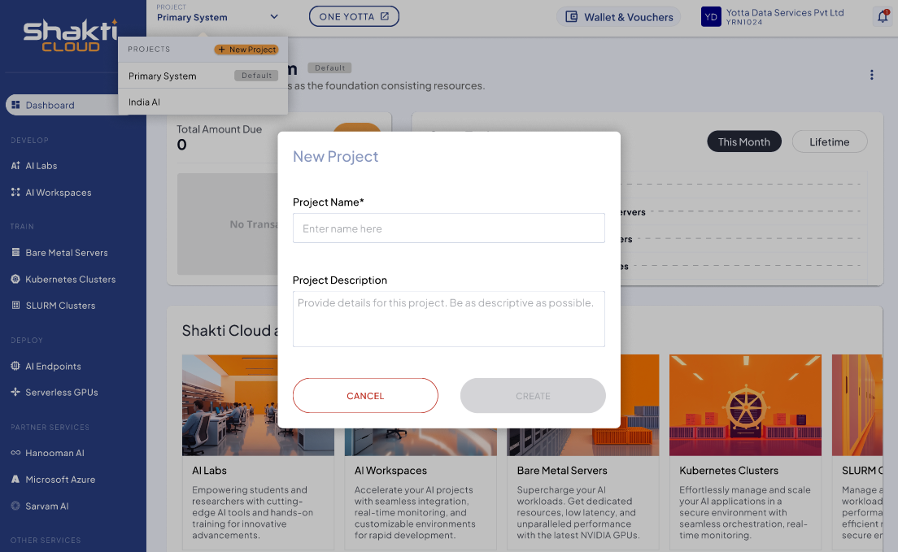
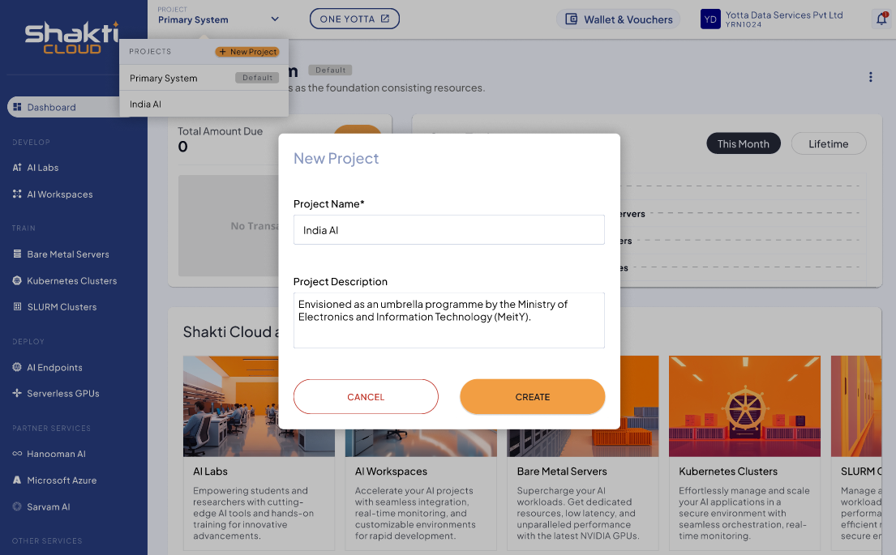
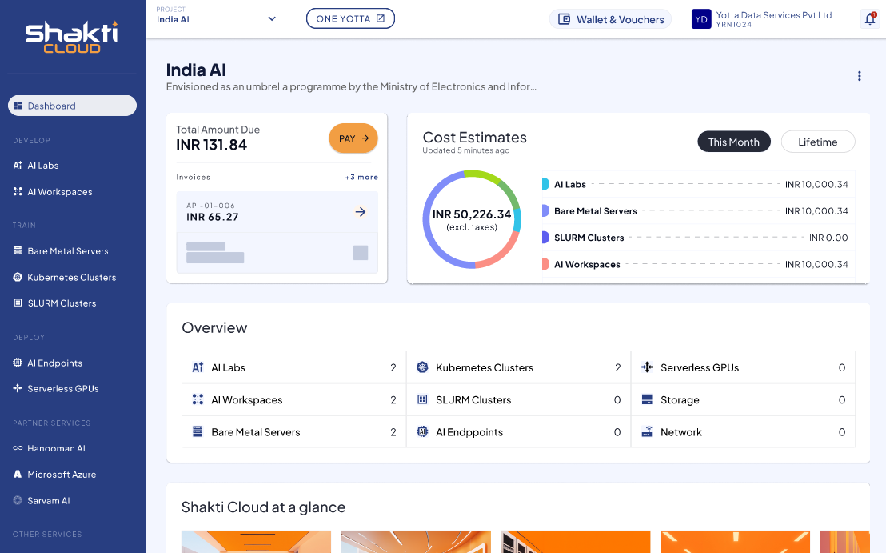

# New Project

You can create a **New Project** based on your requirements and purchase various services. A project dropdown at the top right of the dashboard screen lets you add new projects as needed.
## Steps to Create a New Project:

1. Click the **+ New Project** button.
   
2. Enter the **Project Name** and **Project Description**.
3. Click **Create**.
   

Once your new project is successfully created, the following purchase details are visible on the dashboard screen:
- The **Total Amount Due** section on the right displays the amount you need to pay. You can complete the payment by clicking the **PAY →** button.
- The **Cost Estimates** section on the left displays the costs for services users purchased this month and over their lifetime.
- The **Overview** section in the center displays how many instances users purchased for each service.
- The **Shakti Cloud at a Glance** section at the bottom displays all available services.
  