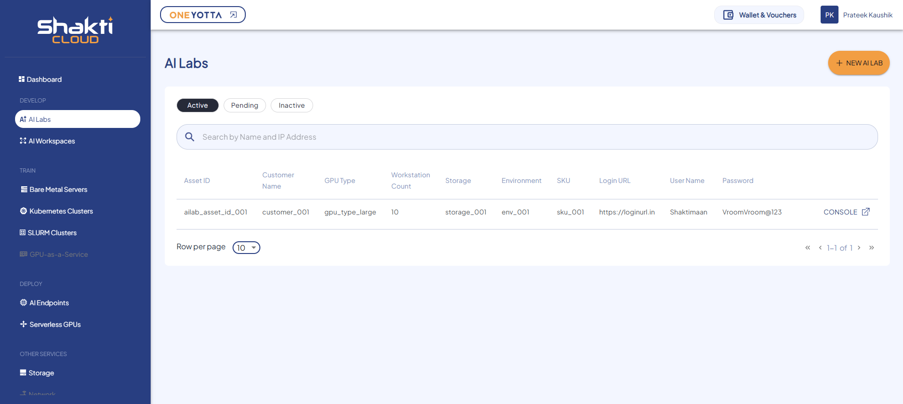

# Creating AI Lab Instance

This service allows users to manage and create AI Labs on the Shakti Cloud Platform, where they can build and deploy AI projects.

1. To create new AI Lab, click the **New AI Lab** button.
	
2. Select a Plan type **Hourly** or **Unlimited**.
   
3. Choose the geographical region for your lab deployment.
   
4. Select the type of lab based on the required configurations.
   
5. Enter the number of workstations required for the lab setup.
6. Select the payment plan (Monthly, Annually) for the lab usage.
7. Select the time limit for automatically shutting down idle workloads.
8. Enter the **Session Duration** for your AI Lab.
9. Specify Additional Object storage.
10. Mention the unique and valid Name of your AI Lab.
11. Specify the unique and valid name of the lab for identification.
    
12. Verify the **Summary & Estimated Costs**.
13. Select the **I have read and agree to the Shakti Cloud Terms of Service** option.
14. Click **SUBMIT REQUEST**.
15. You get the following screen, click **CONFIRM** to Launch the resource.
	