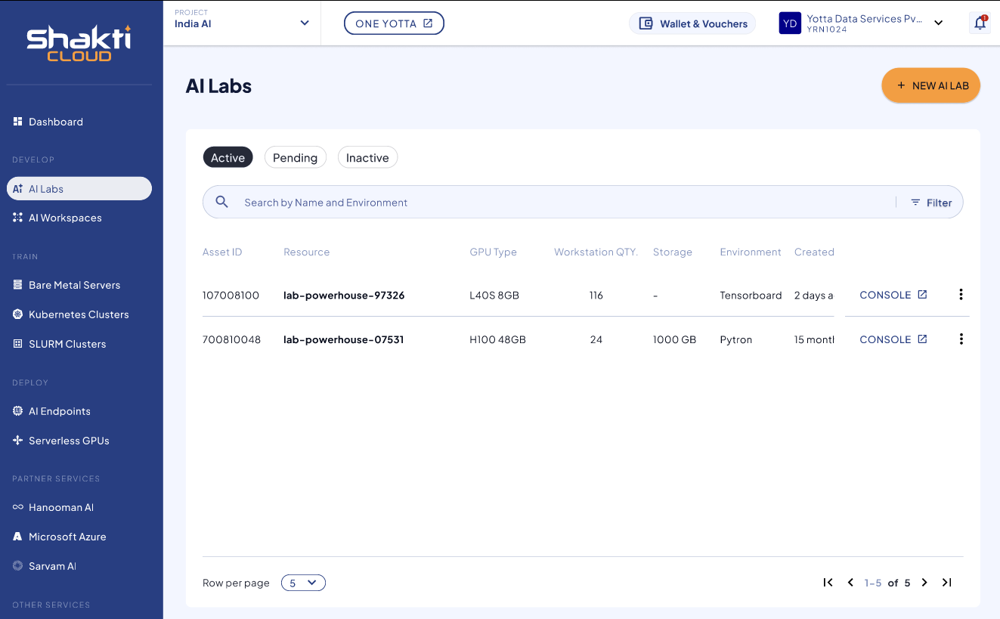
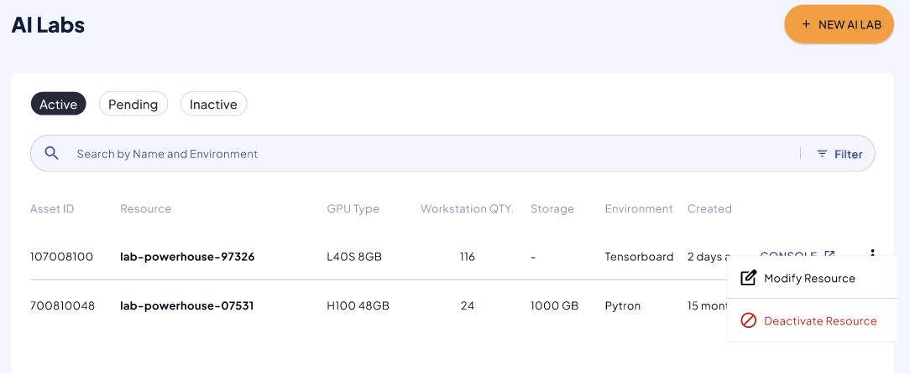

To view the available AI Lab instances, navigate to the **AI Lab Instance** screen.  
Here, you can see the following details:

- Asset ID
- Resource
- GPU Type
- Workstation Quantity
- Storage
- Environment
- Created Date

The dashboard includes the following modes:
- Active
- Pending
- Inactive

Once you click the three dots at the end of each row, you can view two options:
- Modify Resource
- Deactivate Resource 

