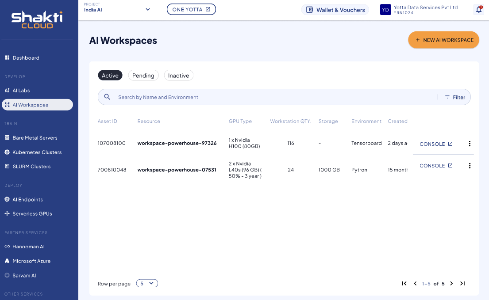

# Viewing Details of AI Workspace

To view the available AI Workspace, navigate to the **AI Workspace** screen.  
Here, you can see the following details:
- Asset ID
- Resource
- GPU Type
- Workstation Quantity
- Storage
- Environment
- Created Date

The dashboard includes the following modes:
- Active
- Pending
- Inactive
