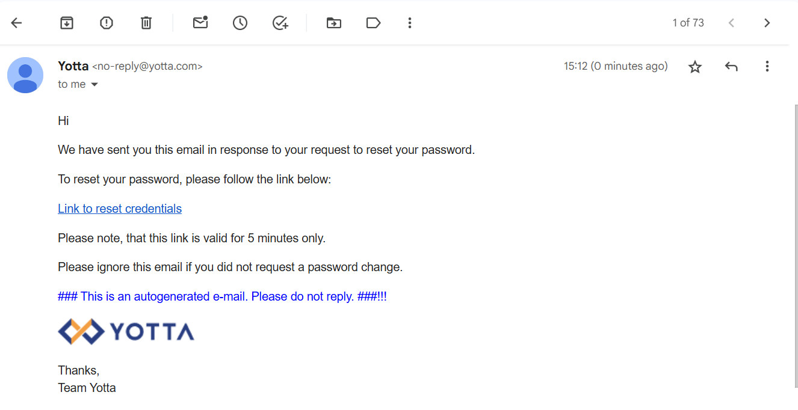

# Resetting Password

To reset a password, follow these steps:

1. You can reset a forgotten password by clicking the **Forgot Password?** link.
	
2. The following window appears, enter your registered email here.
	
3. If the entered email is valid and exists in the system, the system sends instructions over email to set a new password.
	