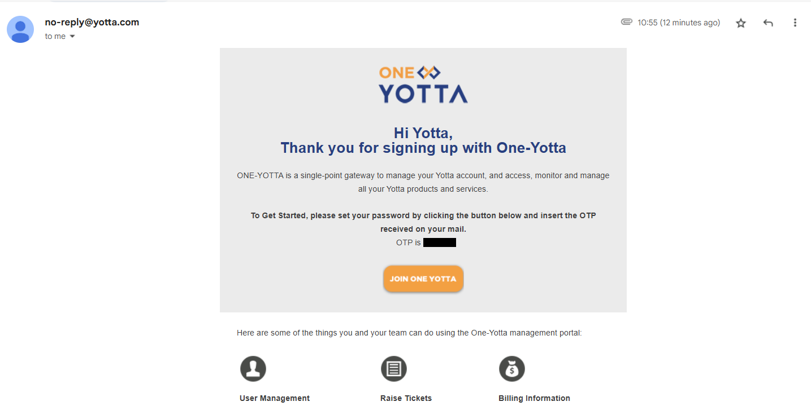
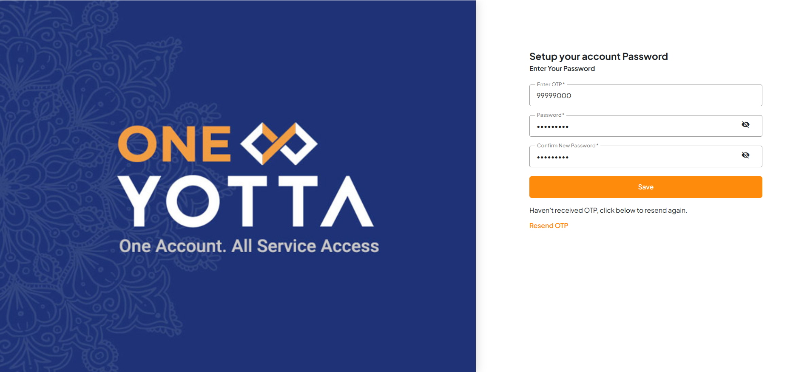

# Signing Up

Shakti offers an easy way of signing up for a subscriber cloud account to access all the services. To create an account, follow these steps:

 1. To navigate to the signup form, click **Sign Up** and fill the required details in the form:
	
	
1. Select **I agree to the terms & conditions and privacy policy**.
2. Click **Submit**.
	
3. You receive an email with instructions at your registered email address. It includes an OTP required to generate your password for the platform.
4. To create your password, click the **JOIN ONE YOTTA** button.
	
5. The following screen appears: 
	
6. Enter the OTP and create the password (In case you don't receive the OTP, click Resend OTP).
7. Click **Save**.

You can easily login into **Shakti Cloud** by using your credentials.

