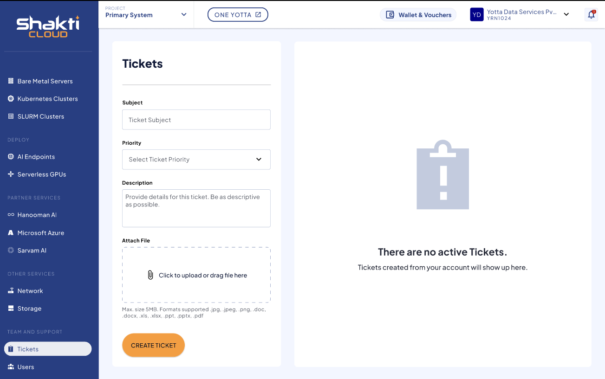

# Creating New Ticket

The following are the steps to create new ticket:

1. In the main navigation panel, select **Tickets**.
2. The following screen appears:
	
3. Enter the required details:
    - **Subject**: Enter a brief subject for the ticket.
    - **Priority**: Set the priority (High or Low).
    - **Description**: Provide a clear description of the issue.
    - **Attach File**: Upload any relevant files (if needed).
4. Click **CREATE TICKET**.

