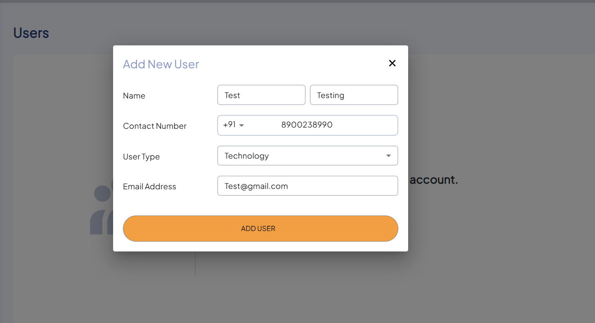

# Creating New User

The following are the steps to create a new user: 

1. Navigate to the **TEAM AND SUPPORT**, select **Users** tab.
2. To create a new user, click **NEW USER**. 
	
3. The following window appears:
	
4. Enter the following details:
    - Name
    - Contact Number
    - User Type
    - Email Address
5. Click **ADD USER**.